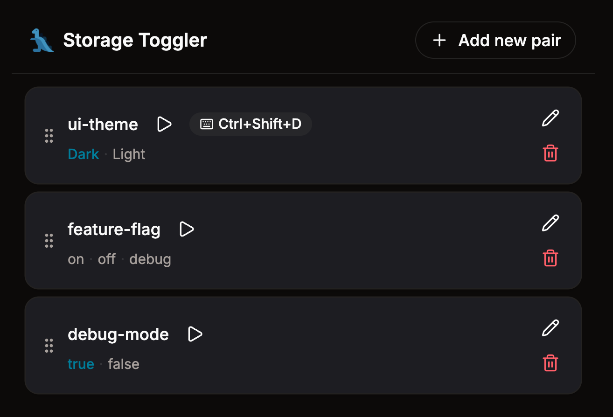

<div align="center">
  
  <h1>Storage Toggler</h1>
  <p>A Chrome extension to toggle localStorage values on any website with one click or keyboard shortcut.</p>

  [](LICENSE)
  [](https://developer.chrome.com/docs/extensions/develop/migrate/what-is-mv3)
</div>


<div align="center">
  
</div>

---

## What it does

Configure localStorage key-value pairs and cycle through their values instantly — via the popup or keyboard shortcuts.

- Define any number of key-value pairs with multiple toggle values
- Assign keyboard shortcuts for hands-free toggling
- Optionally reload the page after each toggle
- Drag & drop to reorder pairs and values
- Configuration syncs across machines via Chrome Sync

## Use cases

- Switch between **dark/light themes** during development
- Toggle **feature flags** without opening DevTools
- Flip **debug modes** on and off
- Any localStorage-driven setting you change frequently

## Tech Stack

| Layer | Technologies |
|---|---|
| **Frontend** | TypeScript, React 19, Tailwind CSS v4, Lucide icons |
| **Extension** | Chrome Manifest V3, Service Worker, Scripting API |
| **DnD** | @dnd-kit/react |
| **Build** | Vite |

## Getting Started

```bash
npm install
npm run build
```

Then load in Chrome:

1. Go to `chrome://extensions`
2. Enable **Developer mode**
3. Click **Load unpacked** → select the `dist/` folder

## Development

```bash
npm run dev:preview    # UI dev server with HMR + mock data
npm run dev            # Watch mode build
```

`dev:preview` opens the popup UI at `http://localhost:5173/dev.html` with mocked Chrome APIs — no extension reload needed.

